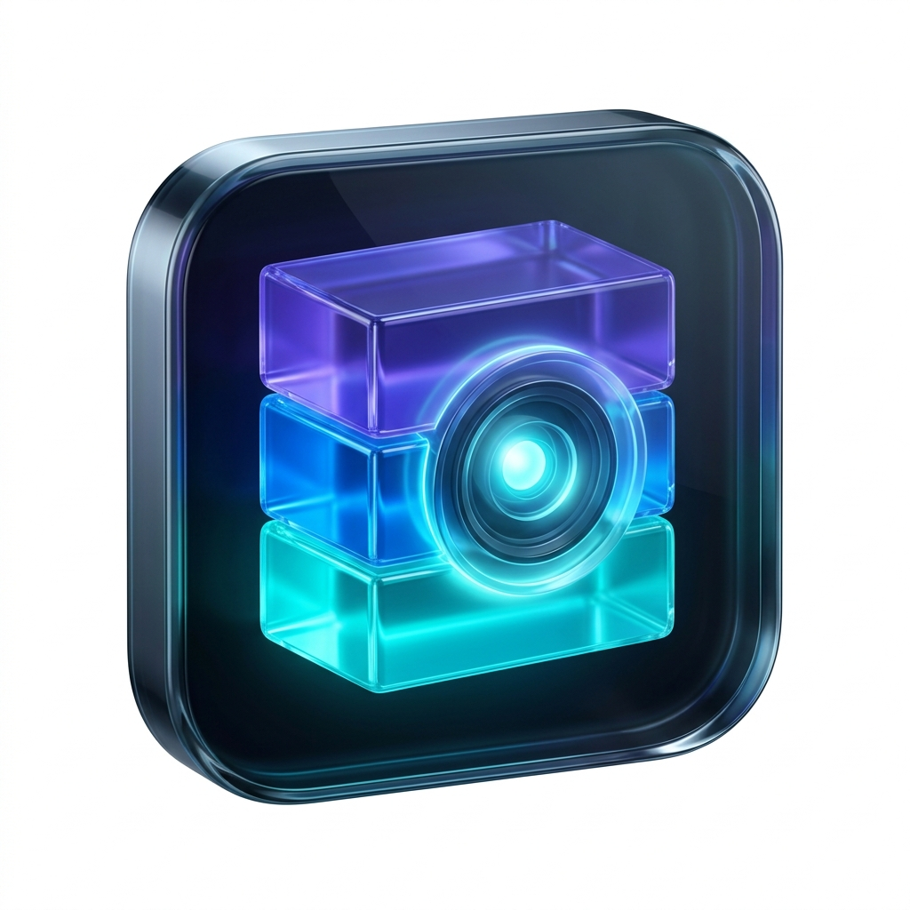

<p align="center">
  
</p>

<h1 align="center">Docker Vision Manager</h1>

<p align="center">
  <strong>Aplicação Desktop (Electron + TypeScript) para gerenciar containers e stacks Docker com facilidade.</strong>
</p>

---

## Funcionalidades

- Listar containers (`docker ps -a`)
- `Start All`
- `Stop All`
- Selecionar containers por checkbox para iniciar/parar em lote
- Fallback automatico de script: tenta Python (`python3`), se falhar usa Bash

## Stack

- Electron
- TypeScript
- Script de controle Docker em:
  - `scripts/docker_control.py`
  - `scripts/docker_control.sh`

## Requisitos

- Node.js 18+
- Docker instalado e rodando
- Python 3 (opcional, recomendado)
- Bash (fallback)

## Como executar

```bash
cd docker-stack-manager
npm install
npm start
```

## Modo Dev (watch)

```bash
npm run dev
```

- Recompila TypeScript automaticamente
- Sincroniza `index.html` e `styles.css` para `dist/`
- Reinicia o Electron ao detectar mudancas em `dist/`

## Build

```bash
npm run build
```

Saida em `dist/`.
